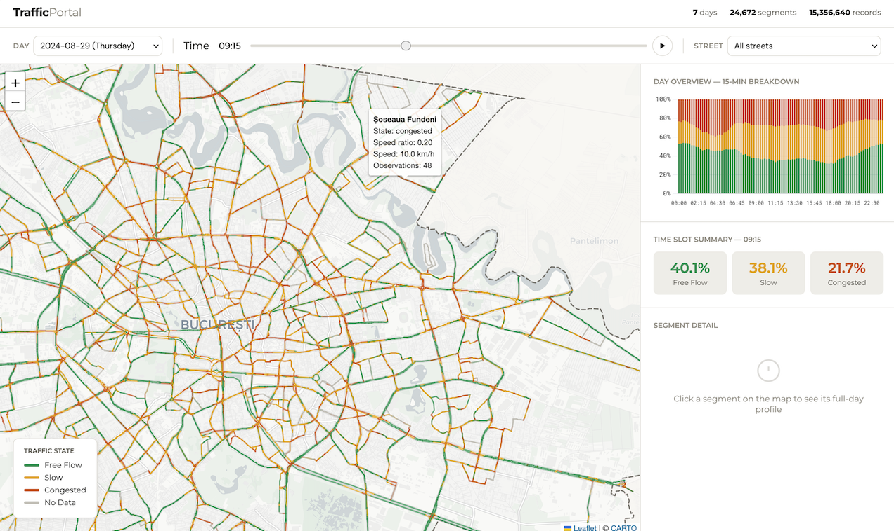
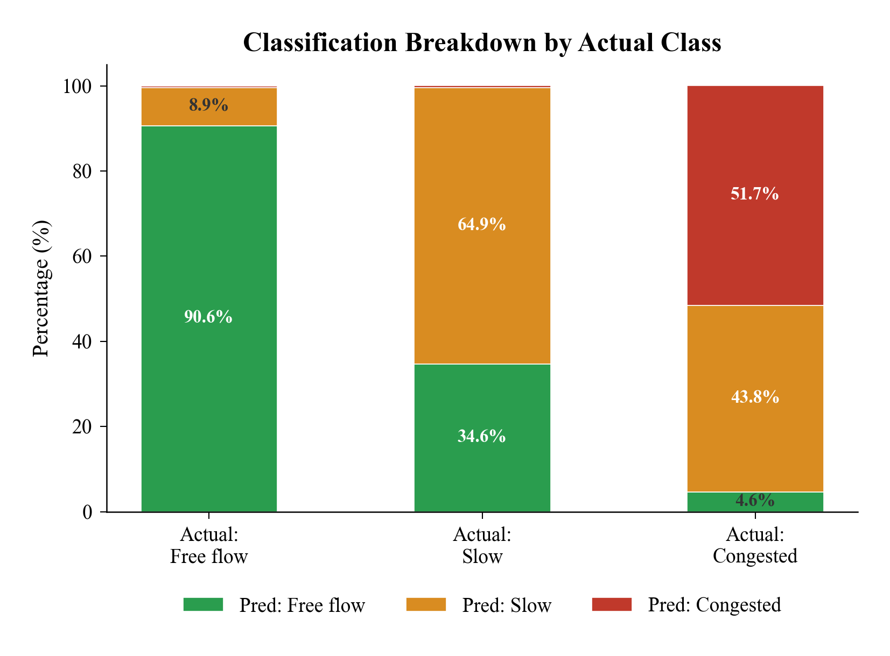

# A Machine Learning Approach to Traffic Analysis and Congestion Detection in Bucharest

This project examines traffic flow across the Bucharest road network during August 25th-31st, 2024. The goal is to analyze traffic conditions across different road segments and times of day, and to evaluate whether historical traffic patterns can be used to classify congestion levels. The project uses XGBoost to classify traffic conditions into three states, while TrafficPortal provides an interactive interface for exploring traffic patterns across the city.

The dataset contains **15,356,640 observations across 24,672 road segments**, collected at 15-minute intervals using the TomTom Traffic Stats API. The project was awarded [**1st place at the Students' Scientific Session, Economic Informatics section**](https://csie.ase.ro/wp-content/uploads/2026/04/Rezultate-SCSS2026.pdf) at Bucharest University of Economic Studies in 2026. Following these results and the feedback received, the project is planned for publication.

## Overview

The project combines traffic data analysis, machine learning classification, and a web visualization platform.

Traffic conditions are classified into three states based on the ratio between observed median speed and the posted speed limit:

* **Free Flow**: speed ratio ≥ 80%
* **Slow**: speed ratio between 40% and 80%
* **Congested**: speed ratio < 40%

The analysis uses 29 features covering historical segment behavior, temporal patterns, city-wide comparisons, and road characteristics. The XGBoost classifier was evaluated using leave-one-day-out cross-validation, where six days are used for training and the remaining day for evaluation.
The model achieved **72.7% overall accuracy**, with a **0.7232 weighted F1 score** and **0.7028 macro F1 score**. Free-flow traffic achieved a recall of **90.6%**, while the congested class achieved **97.4% precision** and **51.7% recall**. The slow class was the most difficult to classify, with an F1 score of **0.5961**.

**Note: The original traffic dataset and the SQLite database are not included in this repository**. The dataset was obtained from the TomTom Traffic Stats API and is too large to distribute as part of the repository. The underlying data and database are also excluded to avoid potential licensing and redistribution issues. The repository therefore contains the project source code and supporting materials, but not the original traffic data.

## Traffic Portal

The project includes an interactive dashboard for exploring the Bucharest road network.

The interface allows users to:

* Select a specific **day**
* Navigate through the day using a **time slider**
* Filter the visualization by **street**
* Explore traffic conditions directly on the map
* Inspect individual road segments
* View traffic-state distributions throughout the day
* Examine summary statistics for selected time slots
* Analyze the full-day traffic profile of individual segments

TrafficPortal is built with **HTML, CSS, and JavaScript** on the client side, with a **Python Flask** backend and an **SQLite** database. **Leaflet.js** is used for the interactive map and **Chart.js** for traffic statistics. Road segments are color-coded as Free Flow, Slow, Congested, or No Data.

The map uses color-coded road segments to make traffic conditions visible across the city. The platform also provides a stacked chart showing traffic-state distributions throughout the day and allows individual segments to be selected for more detailed analysis.

## Traffic Classification

A key part of the analysis is the classification of road segments into three traffic states based on their observed speed relative to the posted speed limit.

The XGBoost model uses historical segment-level traffic patterns as its strongest source of information. The most important features were **historical segment speed by hour (26.2%)**, **segment speed relative to the city-wide average (23.9%)**, and **sample size (19.3%)**.

The following visualization shows the distribution of predicted traffic states for each actual traffic class:

The classification results show that free-flow traffic is identified relatively consistently, while the model has more difficulty distinguishing the transitional **Slow** state and detecting all instances of **Congested** traffic. In particular, **43.8% of actual congested observations were classified as slow**, while **34.6% of actual slow observations were classified as free flow**.

These results provide a basis for evaluating the classification approach and identifying where additional data and improved features could increase prediction reliability. The study's main limitation is the seven-day observation period, which limits the model's ability to capture seasonal variation, events, and longer-term traffic patterns. Future work focuses on expanding the dataset over several months and improving slow-class and peak-hour classification.
